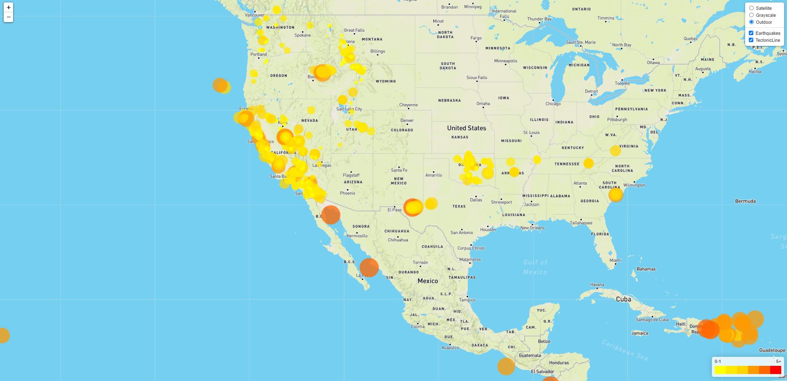
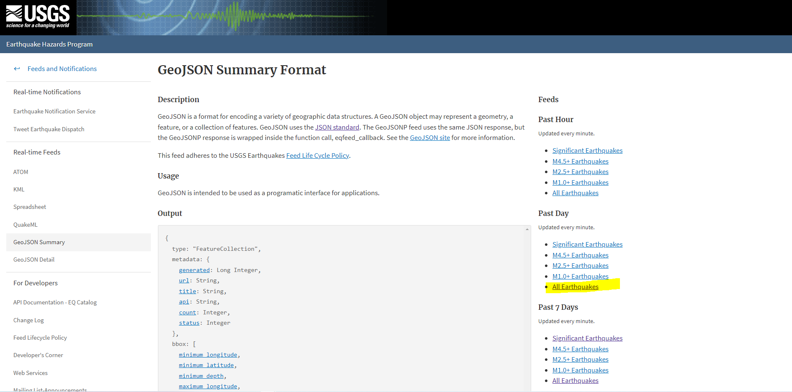
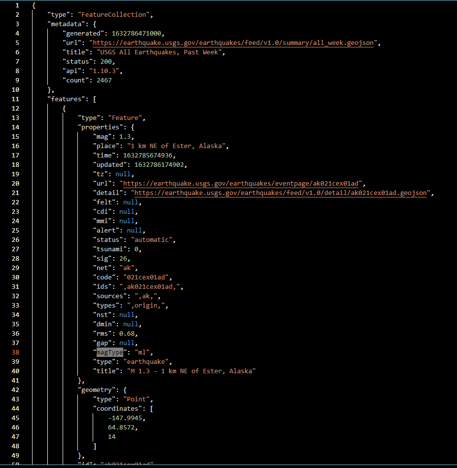
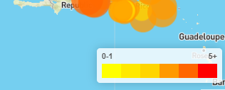
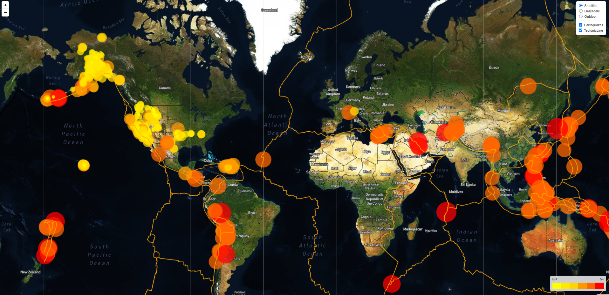
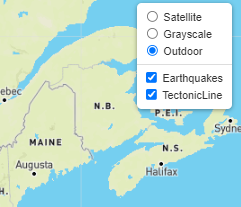

# Leaflet Homework: 
## Visualizing Data with Leaflet

## Background

Welcome to the United States Geological Survey, or USGS for short. The USGS is responsible for providing scientific data about natural hazards, the health of our ecosystems and environment; and the impacts of climate and land-use change. Their scientists develop new methods and tools to supply timely, relevant, and useful information about the Earth and its processes. 

The USGS is interested in building a new set of tools that will allow them to visualize their earthquake data. They collect a massive amount of data from all over the world each day, but they lack a meaningful way of displaying it. Their hope is that being able to visualize their data will allow them to better educate the public and other government organizations (and hopefully secure more funding) on issues facing our planet.

### Level 1: Basic Visualization

### Data:
   

   The USGS provides earthquake data in a number of different formats, updated every 5 minutes. Visited the [USGS GeoJSON Feed](http://earthquake.usgs.gov/earthquakes/feed/v1.0/geojson.php) page and picked "All Eartquakes" data set to visualize. I used the URL of this JSON to pull in the data for my visualization.

   

**1 . Import & Visualize the Data**

   Createw a map using Leaflet that plots all of the earthquakes from your data set based on their longitude and latitude.

   * My data markers reflected the magnitude of the earthquake by their size and and depth of the earthquake by color. Earthquakes with higher magnitudes appeared larger and earthquakes with greater appeared darker in color.

   * Created a legend that provides context for my map data.

   * Your visualization should look something like the map above.

### Level 2: More Data 

As a second data set on my map to illustrate the relationship between tectonic plates and seismic activity, I used data on tectonic plates here <https://github.com/fraxen/tectonicplates>.

In this step:

* Plotted a second data set on our map.

* Added a number of base maps to choose from as well as separate out our two different data sets into overlays that can be turned on and off independently.

* Added layer controls to our map.

- - -
